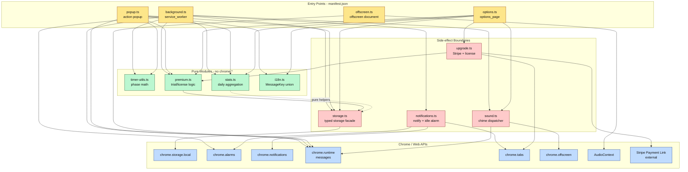

# Architecture: focus-timer (MV3 Chrome Extension)

focus-timer は Manifest V3 の Chrome 拡張で、タイマーの "唯一の真" を service worker (`background.ts`) と `chrome.storage.local` に置き、popup / options / offscreen は観測者として描画・入出力に徹する。
このドキュメントは、どのモジュールがどの Chrome API に触れるか、どこにビジネスロジックが集中しているかを Mermaid 図で可視化する。

## レイヤ構成

- **エントリポイント** (manifest から起動される): `background.ts`, `popup.ts`, `options.ts`, `offscreen.ts`
- **状態の単一窓口**: `storage.ts` (`chrome.storage.local` の型付ラッパ)
- **純粋ロジック** (DOM/chrome.* に触れない): `timer-utils.ts`, `stats.ts`, `premium.ts`, `i18n.ts` (の型部分)
- **副作用境界**: `notifications.ts`, `sound.ts`, `upgrade.ts`

設計上の原則: popup / options は `chrome.storage.local` を `onChanged` で観測するだけで、フェーズ計算や状態遷移は行わない。`background.ts` だけが書き込みの権利を持つ。

## コンポーネント図



## データフロー: フェーズ遷移

work → break の境界が `chrome.alarms` で発火したときの流れ。

```mermaid
sequenceDiagram
    participant AL as chrome.alarms
    participant BG as background.ts
    participant STG as storage.ts
    participant NOT as notifications.ts
    participant SND as sound.ts
    participant OFF as offscreen.ts
    participant POP as popup.ts (observer)

    AL->>BG: onAlarm "focus-timer:phase-end"
    BG->>STG: get(timer, settings)
    BG->>BG: nextMode() + totalForMode()
    BG->>STG: set(new TimerState)
    BG->>NOT: notifyPhaseTransition(mode)
    NOT->>NOT: chrome.notifications.create
    BG->>SND: playPhaseTransition(mode, settings)
    SND->>OFF: chrome.runtime.sendMessage sound_play
    OFF->>OFF: AudioContext chime
    BG->>AL: alarms.create for next boundary
    STG-->>POP: onChanged event
    POP->>POP: render new mode + remaining
```

## 状態キー

`chrome.storage.local` のトップレベルキーは 4 つだけ。スキーマは `storage.ts` の型でロックされている。

| キー | 型 | 書き手 | 読み手 |
| --- | --- | --- | --- |
| `settings` | `Settings` | options | background, popup |
| `timer` | `TimerState` | background のみ | popup, options |
| `stats` | `Stats` | background, options (リセット) | popup, options |
| `premium` | `Premium` | background (trial 開始), upgrade (license 適用) | popup, options |

## 関連設計

- [[design-break-reminder]] — 通知 / idle reminder の発火条件
- [[design-session-stats]] — `stats` の集計仕様
- [[design-sound-mute]] — offscreen と child-mode 上限
- [[design-child-mode]] — child mode による UI / 音量制限
- [[design-big-visual-timer]] — popup の SVG リング描画
